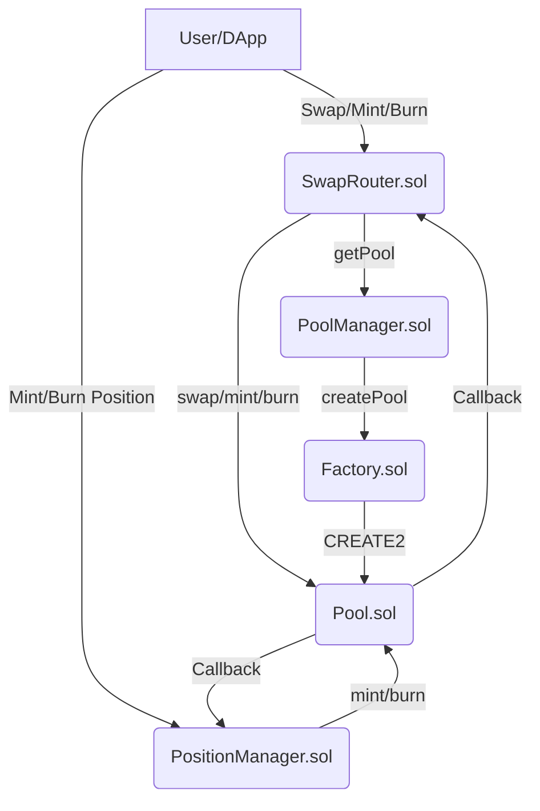
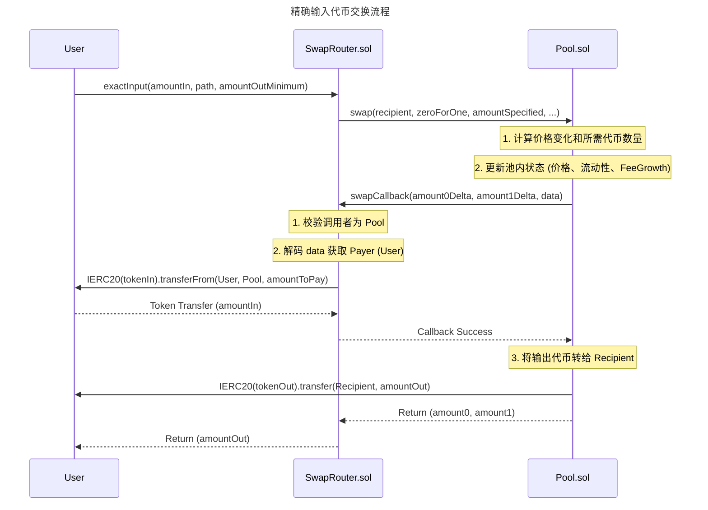
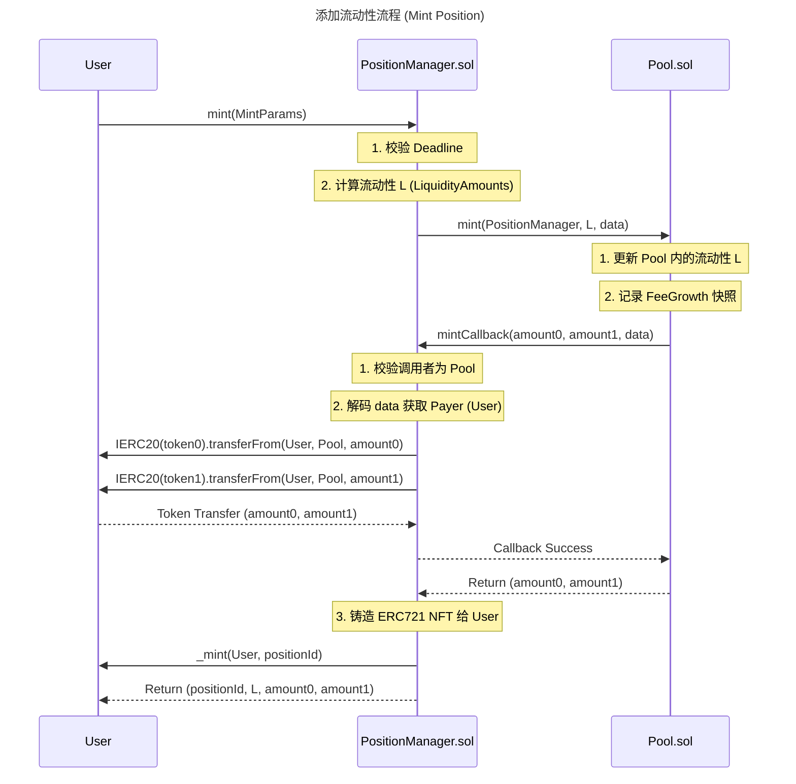

## 一、整体技术实现：架构设计与技术栈

### 1.1 架构设计与技术栈选型

`meta-swap` 项目的核心架构采用了 **集中流动性自动做市商 (Concentrated Liquidity Market Maker, CLMM)** 模型，与 **Uniswap V3** 的设计理念高度一致。该架构将系统功能划分为三个核心层级：工厂层、池层和路由层。

| 模块 | 核心合约 | 职责 | 技术栈/标准 |
| :--- | :--- | :--- | :--- |
| **工厂层** | `Factory.sol` | 负责池的创建与地址确定性计算（使用 `CREATE2`）。 | Solidity, `CREATE2` |
| **管理层** | `PoolManager.sol` | 负责池的查询、创建和初始化，是路由与池之间的桥梁。 | Solidity, 继承 `Factory` |
| **池层** | `Pool.sol` | 核心 AMM 逻辑，负责价格计算、流动性管理、手续费累积和代币交换。 | Solidity, Uniswap V3 Core Libraries |
| **路由层** | `SwapRouter.sol` | 负责用户交互的入口，处理多步交易路径、滑点控制和代币转账。 | Solidity, `ISwapCallback` |
| **流动性管理** | `PositionManager.sol` | 负责流动性头寸的铸造、销毁和费用提取，将头寸代币化为 **ERC721 NFT**。 | Solidity, ERC721 |

**技术栈选型：**
项目基于 **Solidity 0.8.28** 版本，并大量复用或借鉴了 **Uniswap V3** 的核心数学库（如 `TickMath`、`SwapMath`、`SqrtPriceMath`）。这种选型策略旨在利用 V3 经过实战检验的 **CLMM 算法**，同时通过自定义 `PoolManager` 和 `PositionManager` 实现特定的业务逻辑扩展。

### 1.2 合约交互关系

系统的核心交互遵循 **工厂-池-路由** 的经典三层结构，其中 `PoolManager` 扮演了核心管理者的角色。

## 二、关键技术细节：AMM 算法与费用机制

### 2.1 集中流动性 AMM 算法

该项目采用的 AMM 算法是 **恒定乘积公式** 的变体，即 **集中流动性 (CLMM)** 模型。

$$
x \cdot y = L^2
$$

其中，$x$ 和 $y$ 是代币储备量，$L$ 是流动性。在 CLMM 中，流动性 $L$ 仅在特定的价格区间 $[P_a, P_b]$ 内有效。

**核心实现细节：**
1.  **价格表示：** 价格采用平方根格式 $\sqrt{P}$，并以 Q64.96 格式的定点数表示（`sqrtPriceX96`）。这种表示方式简化了价格与流动性之间的数学运算。
2.  **Tick 机制：** 价格空间被划分为离散的 **Tick**。流动性提供者 (LP) 在两个 Tick (`tickLower` 和 `tickUpper`) 之间提供流动性。
3.  **流动性计算：** 在 `PositionManager.sol` 的 `mint` 函数中，通过调用 `LiquidityAmounts.getLiquidityForAmounts` 计算给定代币数量和价格范围下的流动性 $L$。

### 2.2 手续费分配机制

手续费机制是典型的 V3 模式，采用 **Fee Growth Global** 累积和 **Fee Growth Inside** 快照计算。

1.  **全局累积 (Fee Growth Global)：**
    *   每次交易发生时，池合约 (`Pool.sol`) 会更新全局变量 `feeGrowthGlobal0X128` 和 `feeGrowthGlobal1X128`。
    *   该值代表了自池创建以来，每单位流动性应获得的手续费累积量。
2.  **持仓快照 (Fee Growth Inside)：**
    *   LP 在铸造或销毁流动性时，`PositionManager.sol` 会记录当前价格区间内的手续费累积快照 (`feeGrowthInsideX128`)。
    *   LP 提取费用时，系统计算：
        $$\text{Fee Owed} = \text{Liquidity} \times (\text{Current Fee Growth} - \text{Last Fee Growth})$$
    *   这种机制确保了费用分配的精确性，即使在 LP 调整流动性范围或价格跨越 Tick 时，也能准确计算应得费用。

### 2.3 LP Token 铸造/销毁逻辑

流动性头寸被代币化为 **ERC721 NFT**，由 `PositionManager.sol` 管理。

| 操作 | 核心函数 | 逻辑描述 |
| :--- | :--- | :--- |
| **铸造 (Mint)** | `PositionManager.mint()` | 1. 计算流动性 $L$。2. 调用 `Pool.mint()`。3. `Pool` 回调 `PositionManager.mintCallback()`，由 `PositionManager` 从用户处转入代币。4. 铸造一个新的 ERC721 NFT，记录头寸信息（`PositionInfo`）。 |
| **销毁 (Burn)** | `PositionManager.burn()` | 1. 验证调用者权限（`_isAuthorizedForToken`）。2. 调用 `Pool.burn()` 移除流动性。3. 计算并累积应得的代币（包括本金和手续费）到头寸的 `tokensOwed` 字段。4. 当流动性为 0 且费用被提取后，销毁 NFT。 |
| **提取费用 (Collect)** | `PositionManager.collect()` | 1. 调用 `Pool.collect()`。2. `Pool` 将头寸中累积的 `tokensOwed` 转移给用户。3. 清零头寸的 `tokensOwed` 记录。 |

## 三、核心业务流程与流程图

### 3.1 核心业务流程：精确输入代币交换 (Exact Input Swap)

用户通过 `SwapRouter.exactInput` 函数发起交易。该流程涉及 **回调机制 (Callback Pattern)**，这是 V3 架构中用于安全转账的核心设计。

### 3.2 核心业务流程：添加流动性 (Mint Position)

用户通过 `PositionManager.mint` 函数添加流动性，同样依赖回调机制来确保代币安全转入。

