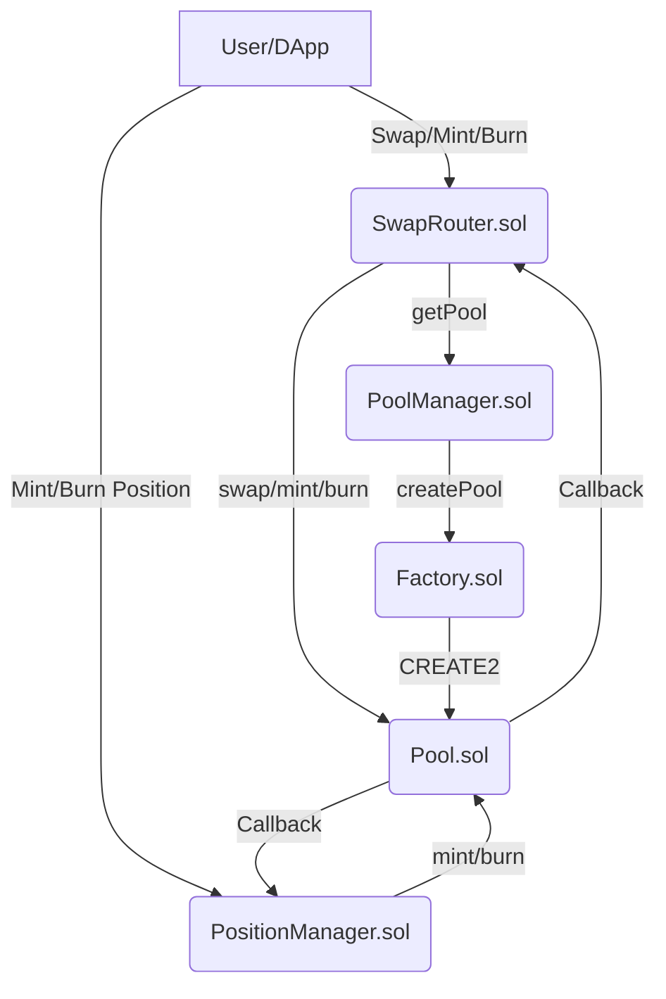
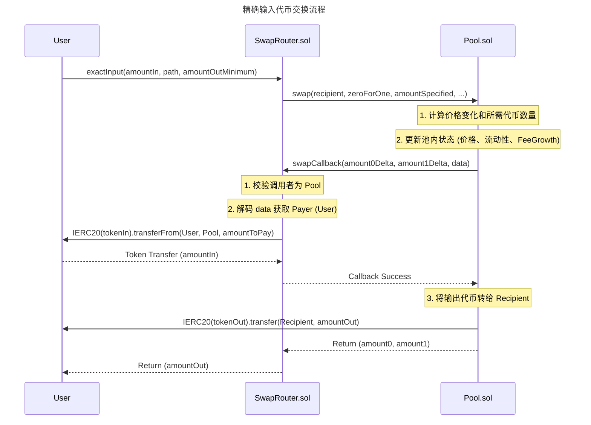
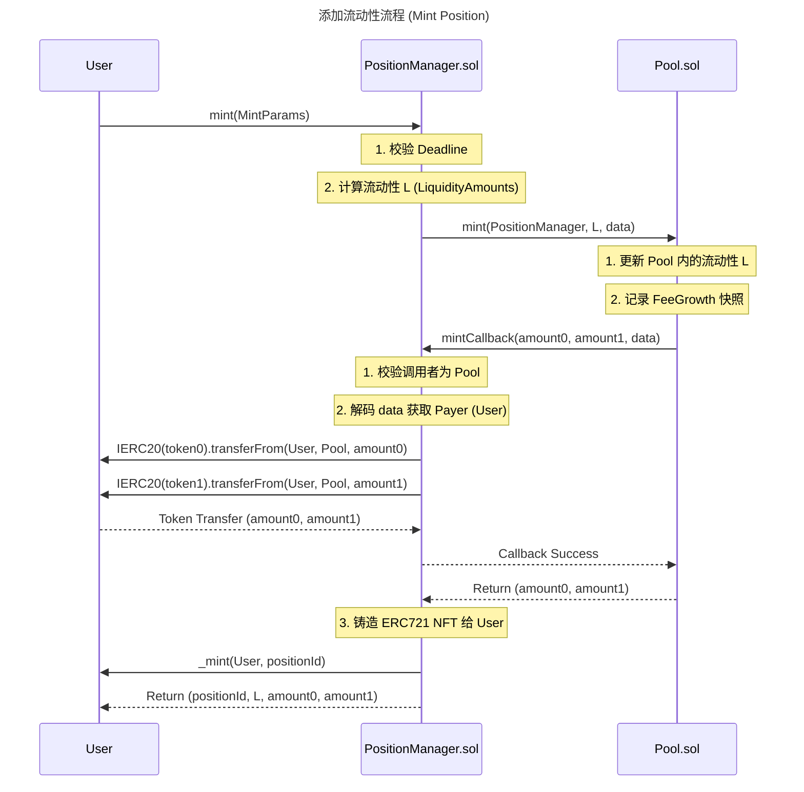

## 一、整体技术实现：架构设计与技术栈

### 1.1 架构设计与技术栈选型

`meta-swap` 项目的核心架构采用了 **集中流动性自动做市商 (Concentrated Liquidity Market Maker, CLMM)** 模型，与 **Uniswap V3** 的设计理念高度一致。该架构将系统功能划分为三个核心层级：工厂层、池层和路由层。

| 模块 | 核心合约 | 职责 | 技术栈/标准 |
| :--- | :--- | :--- | :--- |
| **工厂层** | `Factory.sol` | 负责池的创建与地址确定性计算（使用 `CREATE2`）。 | Solidity, `CREATE2` |
| **管理层** | `PoolManager.sol` | 负责池的查询、创建和初始化，是路由与池之间的桥梁。 | Solidity, 继承 `Factory` |
| **池层** | `Pool.sol` | 核心 AMM 逻辑，负责价格计算、流动性管理、手续费累积和代币交换。 | Solidity, Uniswap V3 Core Libraries |
| **路由层** | `SwapRouter.sol` | 负责用户交互的入口，处理多步交易路径、滑点控制和代币转账。 | Solidity, `ISwapCallback` |
| **流动性管理** | `PositionManager.sol` | 负责流动性头寸的铸造、销毁和费用提取，将头寸代币化为 **ERC721 NFT**。 | Solidity, ERC721 |

**技术栈选型：**
项目基于 **Solidity 0.8.28** 版本，并大量复用或借鉴了 **Uniswap V3** 的核心数学库（如 `TickMath`、`SwapMath`、`SqrtPriceMath`）。这种选型策略旨在利用 V3 经过实战检验的 **CLMM 算法**，同时通过自定义 `PoolManager` 和 `PositionManager` 实现特定的业务逻辑扩展。

### 1.2 合约交互关系

系统的核心交互遵循 **工厂-池-路由** 的经典三层结构，其中 `PoolManager` 扮演了核心管理者的角色。

## 二、关键技术细节：AMM 算法与费用机制

### 2.1 集中流动性 AMM 算法

该项目采用的 AMM 算法是 **恒定乘积公式** 的变体，即 **集中流动性 (CLMM)** 模型。

$$
x \cdot y = L^2
$$

其中，$x$ 和 $y$ 是代币储备量，$L$ 是流动性。在 CLMM 中，流动性 $L$ 仅在特定的价格区间 $[P_a, P_b]$ 内有效。

**核心实现细节：**
1.  **价格表示：** 价格采用平方根格式 $\sqrt{P}$，并以 Q64.96 格式的定点数表示（`sqrtPriceX96`）。这种表示方式简化了价格与流动性之间的数学运算。
2.  **Tick 机制：** 价格空间被划分为离散的 **Tick**。流动性提供者 (LP) 在两个 Tick (`tickLower` 和 `tickUpper`) 之间提供流动性。
3.  **流动性计算：** 在 `PositionManager.sol` 的 `mint` 函数中，通过调用 `LiquidityAmounts.getLiquidityForAmounts` 计算给定代币数量和价格范围下的流动性 $L$。

### 2.2 手续费分配机制

手续费机制是典型的 V3 模式，采用 **Fee Growth Global** 累积和 **Fee Growth Inside** 快照计算。

1.  **全局累积 (Fee Growth Global)：**
    *   每次交易发生时，池合约 (`Pool.sol`) 会更新全局变量 `feeGrowthGlobal0X128` 和 `feeGrowthGlobal1X128`。
    *   该值代表了自池创建以来，每单位流动性应获得的手续费累积量。
2.  **持仓快照 (Fee Growth Inside)：**
    *   LP 在铸造或销毁流动性时，`PositionManager.sol` 会记录当前价格区间内的手续费累积快照 (`feeGrowthInsideX128`)。
    *   LP 提取费用时，系统计算：
        $$\text{Fee Owed} = \text{Liquidity} \times (\text{Current Fee Growth} - \text{Last Fee Growth})$$
    *   这种机制确保了费用分配的精确性，即使在 LP 调整流动性范围或价格跨越 Tick 时，也能准确计算应得费用。

### 2.3 LP Token 铸造/销毁逻辑

流动性头寸被代币化为 **ERC721 NFT**，由 `PositionManager.sol` 管理。

| 操作 | 核心函数 | 逻辑描述 |
| :--- | :--- | :--- |
| **铸造 (Mint)** | `PositionManager.mint()` | 1. 计算流动性 $L$。2. 调用 `Pool.mint()`。3. `Pool` 回调 `PositionManager.mintCallback()`，由 `PositionManager` 从用户处转入代币。4. 铸造一个新的 ERC721 NFT，记录头寸信息（`PositionInfo`）。 |
| **销毁 (Burn)** | `PositionManager.burn()` | 1. 验证调用者权限（`_isAuthorizedForToken`）。2. 调用 `Pool.burn()` 移除流动性。3. 计算并累积应得的代币（包括本金和手续费）到头寸的 `tokensOwed` 字段。4. 当流动性为 0 且费用被提取后，销毁 NFT。 |
| **提取费用 (Collect)** | `PositionManager.collect()` | 1. 调用 `Pool.collect()`。2. `Pool` 将头寸中累积的 `tokensOwed` 转移给用户。3. 清零头寸的 `tokensOwed` 记录。 |

## 三、核心业务流程与流程图

### 3.1 核心业务流程：精确输入代币交换 (Exact Input Swap)

用户通过 `SwapRouter.exactInput` 函数发起交易。该流程涉及 **回调机制 (Callback Pattern)**，这是 V3 架构中用于安全转账的核心设计。

### 3.2 核心业务流程：添加流动性 (Mint Position)

用户通过 `PositionManager.mint` 函数添加流动性，同样依赖回调机制来确保代币安全转入。

## 四、安全机制与风险分析

### 4.1 安全机制：Checks-Effects-Interactions 模式

该项目在核心交易和流动性管理中，通过 **回调机制** 间接实现了 **Checks-Effects-Interactions (CEI) 模式** 的严格遵循：

1.  **Checks (检查)：** 在 `SwapRouter.swapCallback` 中，首先检查调用者是否为预期的 `Pool` 合约，防止未经授权的调用。
2.  **Effects (影响)：** 在 `Pool.swap` 中，先计算价格变化、更新池内状态（`sqrtPriceX96`、`tick`、`feeGrowthGlobal`），这些是状态变更。
3.  **Interactions (交互)：** 最后，通过 `swapCallback` 触发外部转账交互（`transferFrom`），确保在所有内部状态更新完成后才进行外部调用。

此外，合约使用了 **`TransferHelper.safeTransfer`** 进行代币转账，这有助于避免因代币合约实现不规范（如返回非布尔值）而导致的交易失败。

### 4.2 潜在安全风险与应对

| 风险类型 | 风险描述 | 项目应对/缓解方案 | 架构师视角分析 |
| :--- | :--- | :--- | :--- |
| **重入攻击 (Reentrancy)** | 在 `Pool.swap` 中，如果回调函数 (`swapCallback`) 再次调用 `Pool` 的函数，可能导致状态不一致。 | **回调隔离：** `Pool.sol` 的 `swap` 函数本身不直接进行转账，而是通过 `swapCallback` 机制将转账逻辑隔离到 `SwapRouter`。`SwapRouter` 在回调中只执行 `transferFrom`，没有再次调用 `Pool` 的逻辑。 | **有效缓解：** 这种 V3 模式的**单向回调**设计是防止重入攻击的有效手段。然而，如果 `Pool` 内部有其他未受保护的外部调用，仍需警惕。 |
| **滑点攻击 (Slippage Attack)** | 恶意用户在交易前通过大额交易操纵价格，或在交易执行期间价格发生剧烈波动。 | **`amountOutMinimum` 和 `sqrtPriceLimitX96`：** `SwapRouter.exactInput` 强制要求用户设置 `amountOutMinimum`（最小输出量）和 `sqrtPriceLimitX96`（价格限制）。 | **标准防护：** 这是 DEX 路由的标准防护措施，确保交易不会因滑点过大而损失。 |
| **闪电贷攻击 (Flash Loan Attack)** | 攻击者利用闪电贷进行大额套利，操纵价格，并可能导致预言机价格被操纵。 | **TWAP 预言机（未见实现）：** 该项目代码中**未发现** Uniswap V3 核心的 **TWAP (Time-Weighted Average Price)** 预言机实现。 | **风险暴露：** 缺乏 TWAP 机制意味着如果其他协议依赖该池的即时价格作为预言机，将面临**价格操纵风险**。对于依赖价格的借贷或清算协议，这是一个重大安全隐患。 |
| **治理风险 (Governance Risk)** | 缺乏明确的治理合约，系统参数（如费用）的修改权限可能集中在少数地址。 | **未见治理模块：** 代码中未发现 `Governor.sol` 或类似的复杂治理合约。权限可能由 `Factory` 或 `PoolManager` 的 `owner` 角色控制。 | **中心化风险：** 如果系统参数（如协议费用）由单一地址控制，存在**中心化风险**。建议引入时间锁（Timelock）和去中心化治理机制。 |

## 五、总结与建议

`meta-swap` 项目是一个基于 **Uniswap V3 架构**的 CLMM 实现，其核心优势在于：

1.  **资本效率高：** 集中流动性设计极大地提高了资本利用率。
2.  **模块化设计：** 遵循 V3 的工厂、池、路由、头寸管理器分离的模块化设计，易于维护和扩展。

**建议：**
1.  **集成 TWAP 预言机：** 引入 V3 的 TWAP 机制，以提供抗操纵的链上价格数据，增强协议的生态安全性。
2.  **完善治理机制：** 引入 **OpenZeppelin Governor** 等标准治理合约，将关键参数的修改权限置于社区或多签控制之下，并设置时间锁，降低中心化风险。
3.  **全面审计：** 在部署主网之前，必须进行全面的智能合约安全审计，特别是针对 V3 复杂数学库的实现细节和回调机制的重入防护。
